# Capstone Project – The Incubator Hub LITA

## Overview
This project focuses on analysing the sales performance of a retail store to derive insights about the business’s performance and segment customers based on purchasing behaviour for a subscription service and to identify trends. This report summarizes the key findings from the sales data analysis and customer segmentation. The analysis is conducted using **SQL**, **Excel**, and **Power BI**, with the following objectives:
1. Analyse sales trends, customer lifetime value, and other key metrics.
2. Segment customers using their subscription patterns to inform marketing strategies.
3. Visualize the findings in Power BI dashboards.

## Table of Contents
- [Data](#data)
- [SQL Queries](#sql-queries)
- [Excel Workbook](#excel-workbook)
- [Power BI Dashboards](#power-bi-dashboards)
- [Reports](#reports)
  - [Sales Analysis](#sales-performance-analysis-for-a-retail-store)
    - [Excel](#excel)
    - [SQL](#sql)
    - [Power BI](#power-bi)
  - [Customer Segmentation](#customer-segmentation-for-a-subscription-service)
    - [Excel](#excel)
    - [SQL](#sql)
    - [Power BI](#power-bi)
- [Conclusion](#conclusion)

## Data
- `LITA Capstone Dataset Raw.xlsx`: Contains the raw sales and customer data used for the analysis.
- `LITA Capstone Dataset.xlsx`: Contains cleaned and transformed data processed in Excel, including pivot table summaries for key insights.

## SQL Queries
- **`LITAPROJECT_SQL.sql`**: SQL queries for analysing sales data for the retail store and customer data for the subscription service.

Example snippet:
```sql
---Total Revenue for Each Product---
SELECT PRODUCT, SUM(TotalRevenue) AS TOTALREVENUE FROM CapstoneDatasetSalesData
GROUP BY PRODUCT
ORDER BY 2 DESC
```

Example snippet:
```sql
---Total Number of Customers from Each Region---
SELECT Region, COUNT(CUSTOMERID) AS TOTALCUSTOMERS FROM CapstoneDatasetCustomerData
GROUP BY Region
```

## Excel Workbook
- **`LITA Capstone Dataset.xlsx`**: Contains data analysis and visualizations of sales trends, revenue, and customer metrics. As well as the customer segmentation analysis for a subscription service.

## Power BI Dashboards
- **`LITA Capstone Project.pbix`**: Power BI dashboard that visualizes total revenue, total sales, units sold, sales growth, and top-performing region by revenue made. It also includes the dashboard that visualizes customer segmentation insights for the subscription service (e.g., cancellations and subscription trends).

## Reports
Provides a comprehensive summary of the analysis and insights derived from the project, including visualizations and detailed customer segments.
### Sales Performance Analysis for a Retail Store

#### Excel 
Total Revenue is calculated for each row with the formula: Quantity * UnitPrice
```excel
   =F2*G2
```
- **Total Sales by Product**:

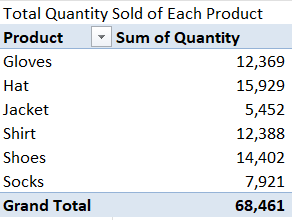
- **Total Sales by Region**:

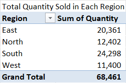   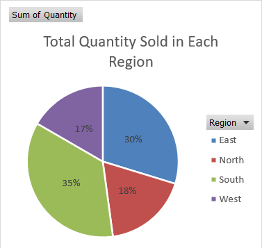
- **Total Sales by Month**:


- **Average Sales per Product**:
```excel
=AVERAGEIF(C2:C9922, "Shoes", F2:F9922)
=AVERAGEIF(C2:C9922, "Shirt", F2:F9922)
=AVERAGEIF(C2:C9922, "Jacket", F2:F9922)
=AVERAGEIF(C2:C9922, "Socks", F2:F9922)
=AVERAGEIF(C2:C9922, "Gloves", F2:F9922)
=AVERAGEIF(C2:C9922, "Hat", F2:F9922)
```

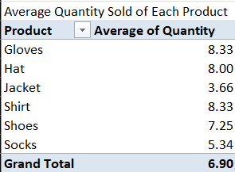
- **Total Revenue by Region**:
```excel
=SUMIF(D2:D9922, "North", H2:H9922)
=SUMIF(D2:D9922, "South", H2:H9922)
=SUMIF(D2:D9922, "East", H2:H9922)
=SUMIF(D2:D9922, "West", H2:H9922)
```

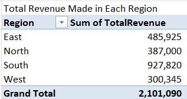  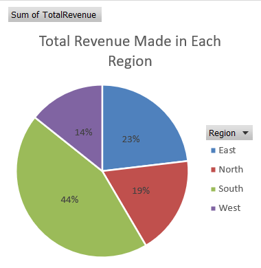
- **Other Insights**:

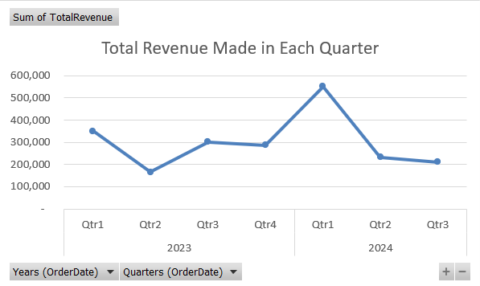  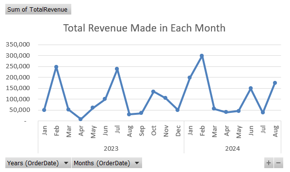  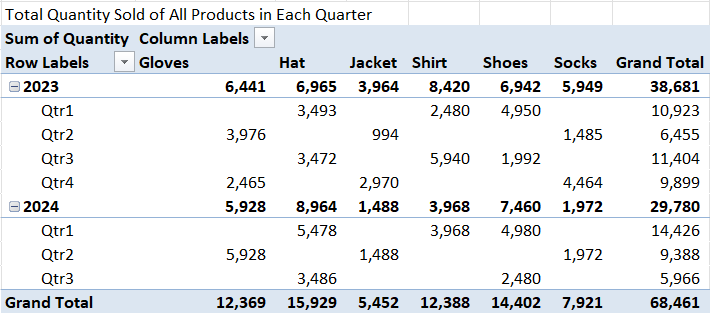
#### SQL
- **Total Sales by Product**:
```sql
---Total Sales For Each Product---
SELECT PRODUCT, SUM(Quantity) AS TOTALSALE FROM CapstoneDatasetSalesData
GROUP BY PRODUCT
ORDER BY 2 DESC
```
- **Total Sales by Region**:
```sql
---Total Sales For Each Region---
SELECT REGION, SUM(Quantity) AS TOTALSALE FROM CapstoneDatasetSalesData
GROUP BY REGION
ORDER BY 2 DESC
```
- **Top Selling Product**:
```sql
---Product With The Most Sales---
SELECT TOP 1 PRODUCT, SUM(Quantity) AS MAXSALE FROM CapstoneDatasetSalesData
GROUP BY PRODUCT
ORDER BY 2 DESC
```
- **Total Revenue by Product**:
```sql
---Total Revenue For Each Product---
SELECT PRODUCT, SUM(TotalRevenue) AS TOTALREVENUE FROM CapstoneDatasetSalesData
GROUP BY PRODUCT
ORDER BY 2 DESC
```
- **Total Monthly Sales for Current Year**:
```sql
---Total Sales in Each Month in the Current Year---
SELECT DATENAME(MONTH,OrderDate) AS MONTH, SUM(Quantity) AS TOTALSALE
FROM CapstoneDatasetSalesData
WHERE YEAR(OrderDate) = YEAR(GETDATE())
GROUP BY MONTH(OrderDate), DATENAME(MONTH,OrderDate)
ORDER BY MONTH(OrderDate)
```
- **Top 5 Customers by Total Purchase Amount**:
```sql
---Top 5 Customers By Total Purchase Amount---
SELECT TOP 5 Customer_Id, SUM(Quantity) AS MAXSPURCHASE FROM CapstoneDatasetSalesData
GROUP BY Customer_Id
ORDER BY 2 DESC
```
- **Percentage of Total Sales Contributed by Each Region**:
```sql
SELECT REGION, SUM(Quantity) * 100 / (SELECT SUM(Quantity) FROM CapstoneDatasetSalesData) AS PERCENTAGEOFTOTALSALE
FROM CapstoneDatasetSalesData
GROUP BY REGION
ORDER BY 2 DESC
```
- **Products With ZERO Sales in the Last Quarter**:
```sql
---Products With no Sales in the Last Quarter---
SELECT PRODUCT FROM CapstoneDatasetSalesData L1
WHERE NOT EXISTS (
     SELECT 1
	 FROM CapstoneDatasetSalesData L2
	 WHERE L2.PRODUCT = L1.PRODUCT
	 AND L2.ORDERDATE >= DATEADD(QUARTER, -1, GETDATE())
)
GROUP BY PRODUCT
```
#### Power BI
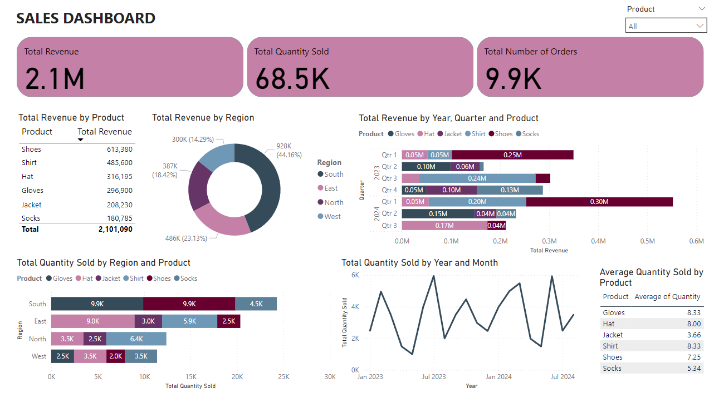

### Customer Segmentation for a Subscription Service

#### Excel
Subscription Duration in days is calculated for each row with the formula: SubscriptionEnd -SubscriptionStart
```excel
   =F2 - E2
```
- **Average Subscription Duration in Days by Type**:

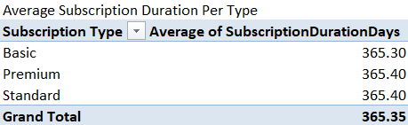
- **Most Popular Subscription Type**:

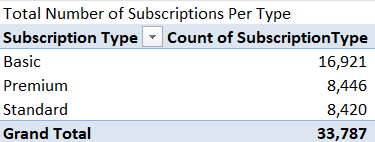
- **Total Revenue by Region**:

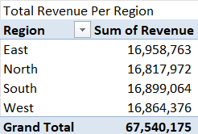
- **Total Revenue by Subscription Type**:

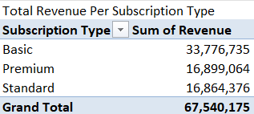
- **Cancelled Subscriptions by Type**:

  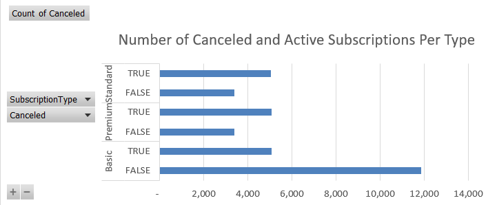
- **Cancelled Subscriptions by Region**:

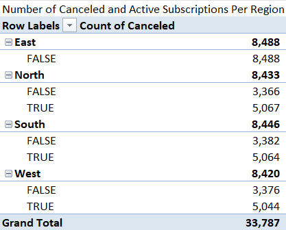  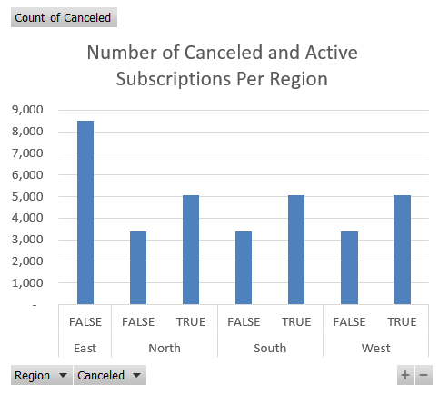

- **Total Active Subscriptions**:
```excel
=COUNTIF(G2:G33788, "FALSE")
```
- **Total Cancelled Subscriptions**:
```excel
=COUNTIF(G2:G33788, "TRUE")
```
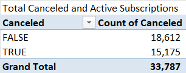
- **Total Revenue of Active and Cancelled Subscriptions by Year**:

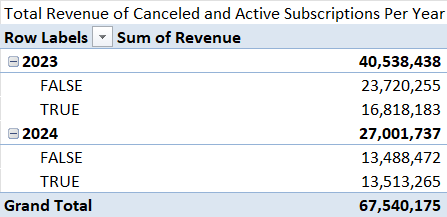
#### SQL
- **Total Customers from Each Region**:
```sql
---Total Number of Customers From Each Region---
SELECT Region, COUNT(CUSTOMERID) AS TOTALCUSTOMERS FROM CapstoneDatasetCustomerData
GROUP BY Region
```
- **Most Popular Subscription Type by Number of Customers**:
```sql
---Most Popular Subscription Type by the Number of Customers---
SELECT SUBSCRIPTIONTYPE, COUNT(SUBSCRIPTIONTYPE) AS TOTALCUSTOMERS FROM CapstoneDatasetCustomerData
GROUP BY SUBSCRIPTIONTYPE
```
- **Customers Who Canceled Their Subscription Within 6 Months**:
```sql
--- Customers Who Canceled Their Subscription Within 6 Months---
SELECT CUSTOMERID FROM CapstoneDatasetCustomerData
WHERE Canceled = 'TRUE'
  AND DATEDIFF(MONTH, SubscriptionStart, SubscriptionEnd) <= 6
```
- **Average Subscription Duration**:
```sql
---Average Subscription Duration---
SELECT AVG(DATEDIFF(DAY, SubscriptionStart, SubscriptionEnd)) AS AvgSubscriptionDuration
FROM CapstoneDatasetCustomerData
```
- **Customers With Subscriptions Longer than 12 Months**:
```sql
---Customers With Subscriptions Longer than 12 Months---
SELECT CustomerID FROM CapstoneDatasetCustomerData
WHERE DATEDIFF(MONTH, SubscriptionStart, SubscriptionEnd) > 12
```
- **Total Revenue by Subscription Type**:
```sql
---Total Revenue by Subscription Type---
SELECT SubscriptionType, SUM(Revenue) AS TOTALREVENUE FROM CapstoneDatasetCustomerData
GROUP BY SubscriptionType
```
- **Top 3 Regions by Subscription Cancellations**:
```sql
---Top 3 Regions by Subscription Cancellations
SELECT TOP 3 Region, COUNT(*) AS TotalCancellations FROM CapstoneDatasetCustomerData
WHERE Canceled = 'TRUE'
GROUP BY Region
ORDER BY TotalCancellations DESC
```
- **Total Number of Active and Canceled Subscriptions**:
```sql
---Total Number of Active and Canceled Subscriptions---
SELECT Canceled, COUNT(*) AS TotalSubscriptions FROM CapstoneDatasetCustomerData
GROUP BY Canceled;
```
#### Power BI
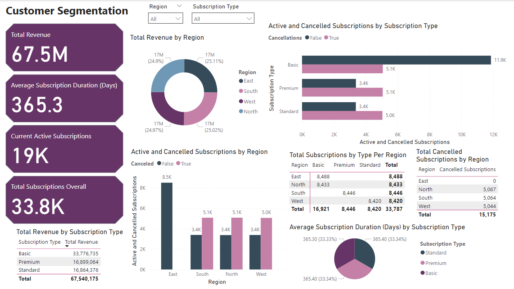

## Conclusion

