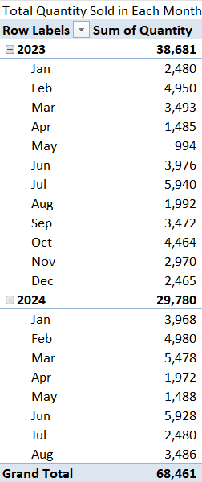

# Capstone Project – The Incubator Hub LITA

## Overview
This project focuses on analysing the sales performance of a retail store to derive insights about the business’s performance and segment customers based on purchasing behaviour for a subscription service and to identify trends. This report summarizes the key findings from the sales data analysis and customer segmentation. The analysis is conducted using **SQL**, **Excel**, and **Power BI**, with the following objectives:
1. Analyse sales trends, customer lifetime value, and other key metrics.
2. Segment customers using their subscription patterns to inform marketing strategies.
3. Visualize the findings in Power BI dashboards.

## Table of Contents
- [Data](#data)
- [SQL Queries](#sql-queries)
- [Excel Reports](#excel-reports)
- [Power BI Dashboards](#power-bi-dashboards)
- [Reports](#reports)

## Data
- `LITA Capstone Dataset Raw.xlsx`: Contains the raw sales and customer data used for the analysis.
- `LITA Capstone Dataset.xlsx`: Contains cleaned and transformed data processed in Excel, including pivot table summaries for key insights.

## SQL Queries
- **`LITAPROJECT_SQL.sql`**: SQL queries for analysing sales data for the retail store and customer data for the subscription service.

Example snippet:
```sql
---Total Revenue for Each Product---
SELECT PRODUCT, SUM(TotalRevenue) AS TOTALREVENUE FROM CapstoneDatasetSalesData
GROUP BY PRODUCT
ORDER BY 2 DESC
```

Example snippet:
```sql
---Total Number of Customers from Each Region---
SELECT Region, COUNT(CUSTOMERID) AS TOTALCUSTOMERS FROM CapstoneDatasetCustomerData
GROUP BY Region
```

## Excel Reports
- **`LITA Capstone Dataset.xlsx`**: Contains data analysis and visualizations of sales trends, revenue, and customer metrics. As well as the customer segmentation analysis for a subscription service.

## Power BI Dashboards
- **`LITA Capstone Project.pbix`**: Power BI dashboard that visualizes total revenue, total sales, units sold, sales growth, and top-performing region by revenue made. It also includes the dashboard that visualizes customer segmentation insights for the subscription service (e.g., cancellations and subscription trends).

## Reports

### Sales Performance Analysis for a Retail Store

#### Excel 
Total Revenue is calculated for each row with the formula: Quantity * UnitPrice
```excel
   =F2*G2
```
- **Total Sales by Product**:


- **Total Sales by Region**:

   
- **Total Sales by Month**:


- **Average Sales per Product**:
```excel
=AVERAGEIF(C2:C9922, "Shoes", F2:F9922)
=AVERAGEIF(C2:C9922, "Shirt", F2:F9922)
=AVERAGEIF(C2:C9922, "Jacket", F2:F9922)
=AVERAGEIF(C2:C9922, "Socks", F2:F9922)
=AVERAGEIF(C2:C9922, "Gloves", F2:F9922)
=AVERAGEIF(C2:C9922, "Hat", F2:F9922)
```


- **Total Revenue by Region**:
```excel
=SUMIF(D2:D9922, "North", H2:H9922)
=SUMIF(D2:D9922, "South", H2:H9922)
=SUMIF(D2:D9922, "East", H2:H9922)
=SUMIF(D2:D9922, "West", H2:H9922)
```

  
- **Other Insights**:

    
#### SQL
#### Power BI

### Customer Segmentation for a Subscription Service

#### Excel
#### SQL
#### Power BI
